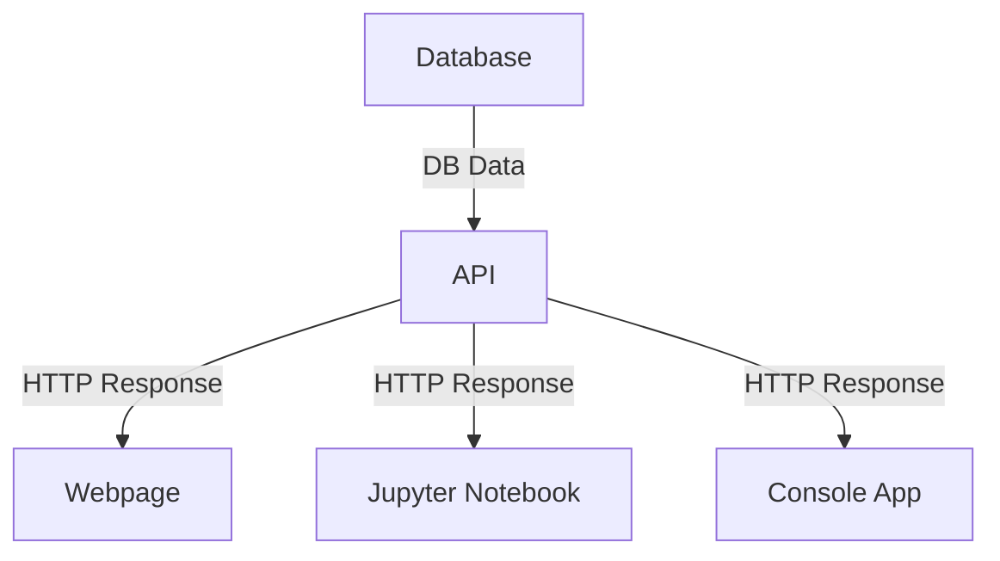

# ISYS5713

This repository represents the assignments that are part of ISYS 5713 - Special Projects in Advanced Data Management with Python.

## Independent Assignments
* [Individual Assignment 1](assignments/Ind_Assignment_1_Getting_into_Git.md) - 
In this assignment, students will be able to practice creating repositories, adding files, committing changes, dealing with branches and managing pull requests.
* [Individual Assignment 2](assignments/Ind_Assignment_2_Object_Orientation.ipynb) - 
The objective of this assignment is to provide you with hands-on experience in creating and manipulating objects in Python using object-oriented programming concepts. You will gain proficiency in defining classes, creating instances, setting attributes, and implementing methods.
* [Individual Assignment 3](assignments/Ind_Assignment_3_Querying_Data.ipynb) - In this assignment, students are going to focus on getting data out of a database, using a few different methods
* [Individual Assignment 4](assignments/Ind_Assignment_4_Using_an_API.ipynb) - In this assignment, students will explore public Application Programming Interfaces (APIs) learn how to make a connection to a public API to query for data and use the data that is returned. 
  
## Group Assignments
(../assignments/01 - Group Project Overview.md)[Group Project Overview] 

