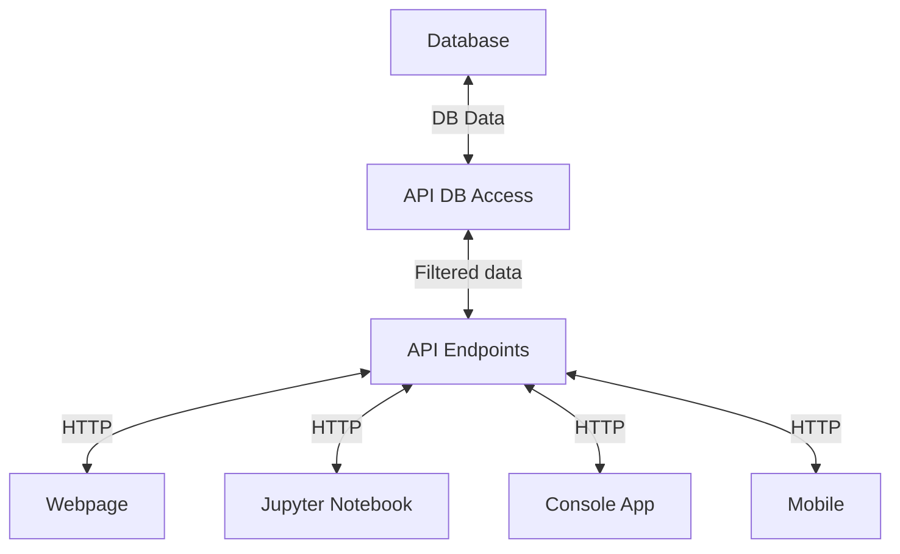
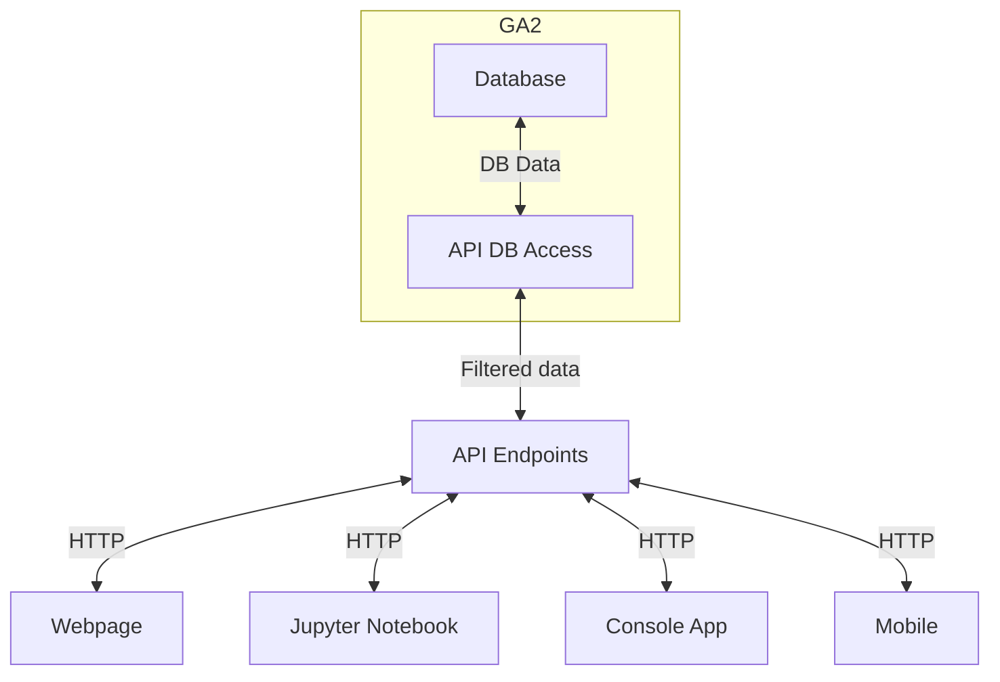
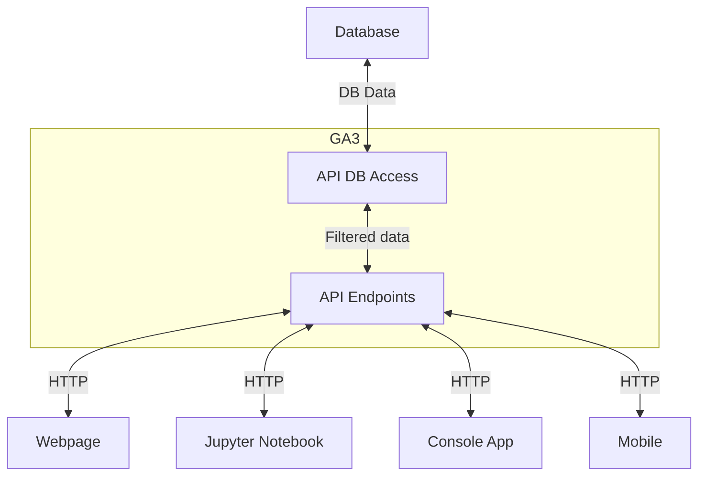
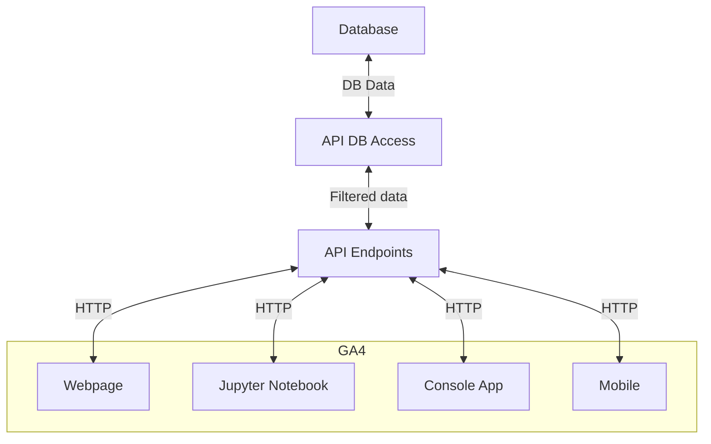

# ISYS58603 - Advanced Data Management

This repository represents the assignments that are part of ISYS 58603 - Advanced Data Management

## Independent Assignments
* [Individual Assignment 1](assignments/Ind_Assignment_1_Getting_into_Git.md) - 
In this assignment, students will be able to practice creating repositories, adding files, committing changes, dealing with branches and managing pull requests.
* [Individual Assignment 2](assignments/Ind_Assignment_2_Object_Orientation.ipynb) - 
The objective of this assignment is to provide you with hands-on experience in creating and manipulating objects in Python using object-oriented programming concepts. You will gain proficiency in defining classes, creating instances, setting attributes, and implementing methods.
* [Individual Assignment 3](assignments/Ind_Assignment_3_Querying_Data.ipynb) - In this assignment, students are going to focus on getting data out of a database, using a few different methods
* [Individual Assignment 4](assignments/Ind_Assignment_4_Using_an_API.ipynb) - In this assignment, students will explore public Application Programming Interfaces (APIs) learn how to make a connection to a public API to query for data and use the data that is returned. 
  
## Group Assignments
The groups assignments will be building toward a deployable API with a unique front-end which provides and example of how to use the API and also excercise the API.  Throughout the group assignments, teams will discover the need to go back and address deficencies in prior areas of the design - so while this is shown as a linear path, that's not how the implementation will actually procede.  Here's the end result

* [Group Assignment 1](assignments/Group_Assignment_1_Vision_and_Design.md) - The goal of this assignment is to establish the project charter and develop the conceptual architecture.
The high-level architecture developed here will outline the various entities that are to be managed in the system, while the project charter establishes the overall goal of the project and key deliverables.

* [Group Assignment 2](assignments/Group_Assignment_2_Loading_Data.md) - The purpose of this assignment is to help students understand how to load data into a database using Python.  Before digging too deeply into this assignment, it may be helpful to review [an example of how the final project may be laid out](https://github.com/ISYS58603/MovieRatings).  You are welcome to structure in whatever makes sense for you, but this simple structure can help to keep things organized.

* [Group Assignment 3](assignments/Group_Assignment_3_Creating_the_API.md) - The purpose of this assignment is to give students the opportunity to design and develop an API which will be able to interact with the database.

* [Group Assignment 4](assignments/Group_Assignment_4_Putting_front-end_on_the_API.md) - The purpose of this assignment is to give students the opportunity to design and develop an API which will be able to interact with the database.

  
