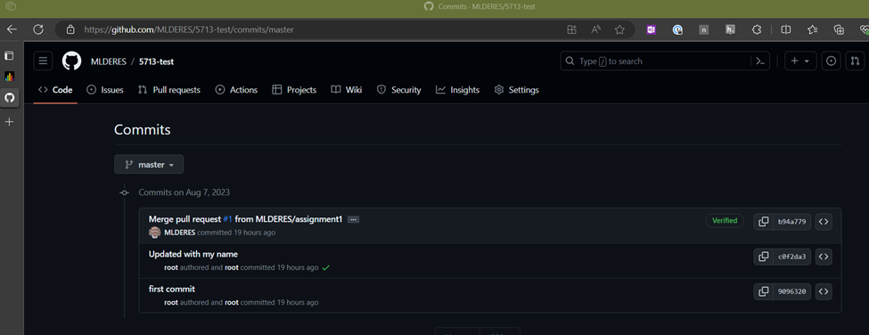
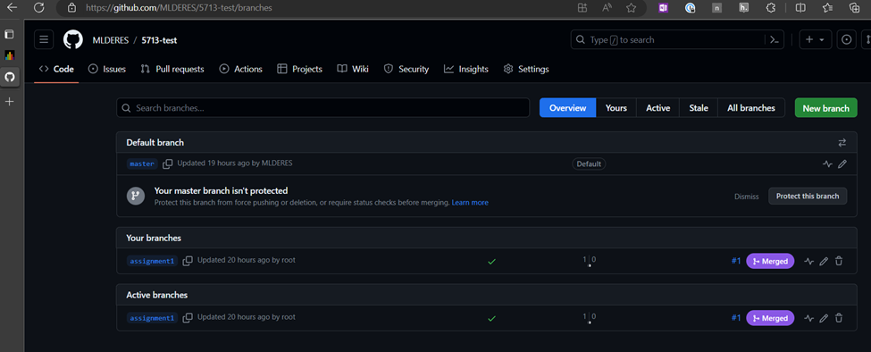
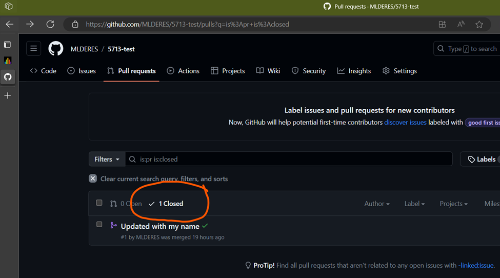

# Goal
Develop some hands on skills with git and GitHub.

# Deliverables (10 pts)
- Link to a repository which demonstrates the student's ability to work with local and remote repositories
- Screenshots of the commit history, pull requests, final state which shows the above steps.

# Background
In the world of Information Systems and Analytics, having the right tools can make all the difference. That's where Git and GitHub come into play. They're not just tech buzzwords – they're essential tools that can shape your success in this dynamic field.
In this assignment, we're diving into the basics of Git and GitHub and discovering why they matter so much. Think of Git as a supercharged undo button for code, while GitHub is like a digital playground where you and your teammates can collaborate on projects. By grasping these tools, you're not just learning something new – you're arming yourself with skills that can truly elevate your game in Information Systems and Analytics

# Instructions

You will be required to complete a series of tasks that showcase your understanding and practical application of Git and GitHub concepts. 
Follow the steps below to successfully complete the assignment:
1.	Repository Creation:
    -	Create a new local repository on your computer.
    -	Initialize the repository with an initial commit containing a README file.
2.	Remote Repository Setup:
    -	Create a new repository on your GitHub account.
    -	Link your local repository to the remote repository using the appropriate commands.
3.	Committing Changes:
    -	Create at least three new files within your local repository.
    -	Make meaningful changes to the files and commit them to the local repository.
    -	Include descriptive commit messages that reflect the purpose of each commit.
4.	Branch Creation:
    -	Create a new branch named "feature-branch" in your local repository.
    -	Switch to the new branch and make additional changes to the files.
    -	Commit these changes to the "feature-branch."
5.	Pull Request Initiation:
    -	Push the "feature-branch" to the remote repository.
    -	On GitHub, initiate a pull request from the "feature-branch" to the main/master branch.
    -	Include a detailed description of the changes made in the pull request.
6.	Pull Request Review:
    -	Review your pull request (or better yet, have a collaborator do it!).
7.	Merging Changes:
    -	After receiving(or giving) approval, merge the "feature-branch" into the main/master branch through the pull request on GitHub.
## Documentation:
- Collect screenshots to show the branches in your repository and that they have been successfully merged
- Include a screenshot with the closed pull request
- Include a screenshot of at least one of the files showing the commit history
## Submission: 
Submit your assignment by providing the following:
1. The URL to your remote GitHub repository.
2. The link to your pull request on GitHub, showcasing the discussion and approval process.
3. PDF with the required documentation

**Note:**
-	If you encounter any issues or have questions during the assignment, don't hesitate to ask for assistance

# Example Submission

## 1. The URL to your remote GitHub repository.
*Github repository:* [MLDERES/5713-test](https://github.com/MLDERES/5713-test) (github.com)

Note: if the repository isn’t public, you will need to add Peter and I as collaborators.  **Me**: mlderes, **Peter**: tuckerpete

## 2. The link to your pull request on GitHub, showcasing the discussion and approval process.
[Updated with my name by MLDERES · Pull Request #1 · MLDERES/5713-test (github.com)](https://github.com/MLDERES/5713-test/pull/1)

## 3. Documentation / Screenshots
- Collect screenshots to show the branches in your repository and that they have been successfully merged
  
- Include a screenshot with the closed pull request
  
- Include a screenshot of at least one of the files showing the commit history

***Figure 1.*** *Shows the commit history of a particular file in the repository*

***Figure 2.*** *Showing the branches that were made.  (NOTE: Feature branches are sometimes deleted after the pull request is closed.  You would have to take this step manually, so for the sake of this assignment, don't delete the branches).*

***Figure 3.*** *Shows that there is one CLOSED pull request.  (Highlighting here is for student reference, e.g. where to find the closed pull request)*